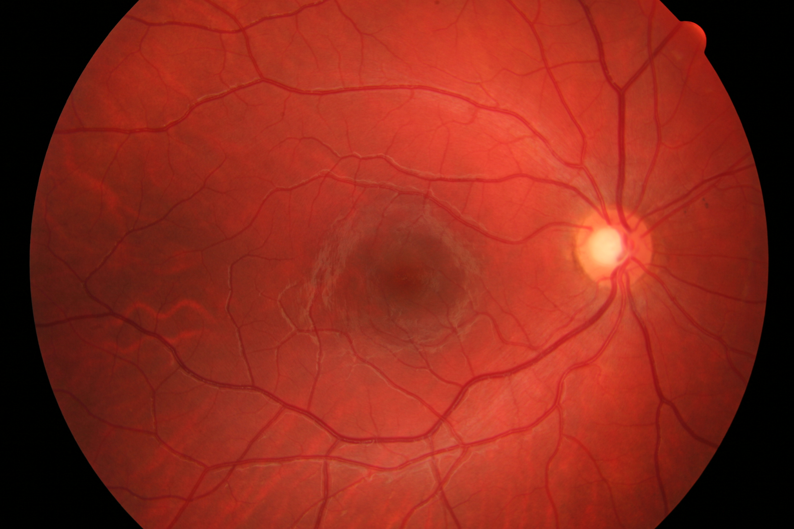
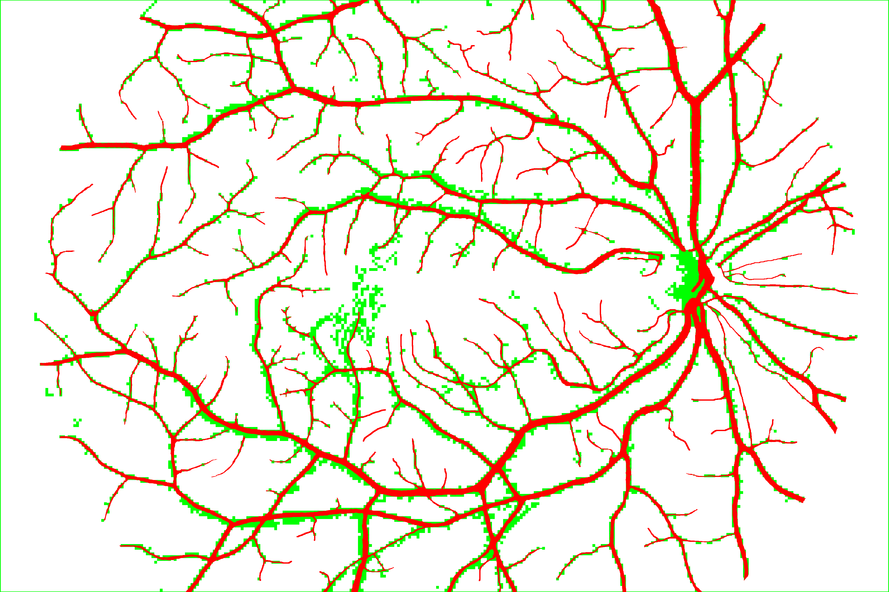
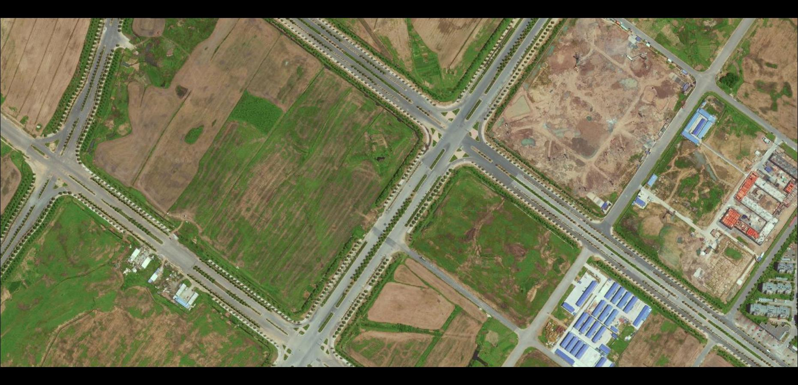
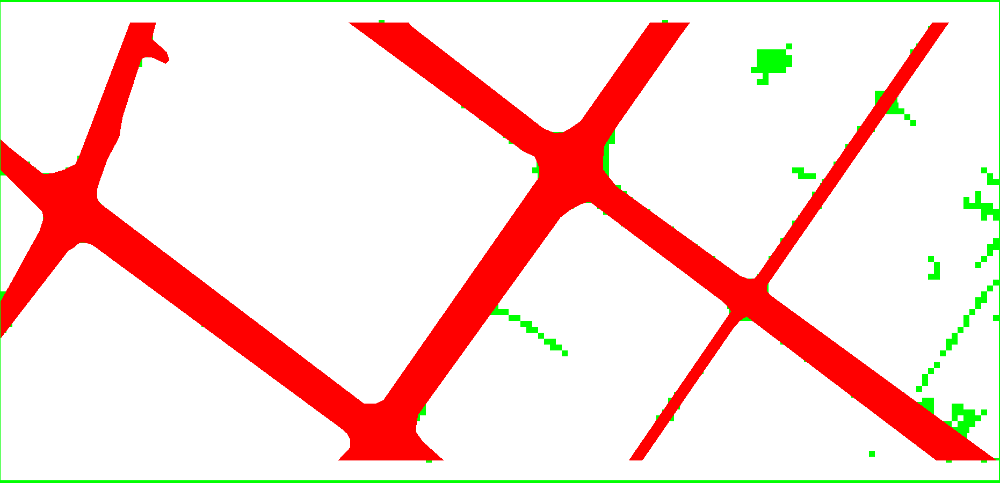

# net-structure_segmentation
C2S: A General Two-Stage Segmentation method for Network-Structure Image 
Object with Little Samples. Paper results demo.

# results
There are two datasets, HRF and ROAD.

|Dataset|Image|Segmentation|
|:---:|:----:|:-----:|
|HRF||
|ROAD||

The color meanings:

|Color|Meaning|
|----|-----|
|RED|True Positive pixels|
|Green|False Positive pixels|
|Blue|False Negative pixels|
|White|True Negative pixels|
|Black|The dropped pixels|

Tips: The most outside green pixels in the segmentation results should be black. Code bug for now.
